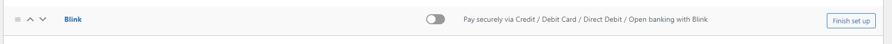

# Blink-WooCommerce-v2

## Description

This module enables the use og the Blink Payment Gateway, utilising the Blink REST API, using the [Woocommerce project](https://woo.com/).
The documentation for the Blink API cna be found [here](https://docs.blinkpayment.co.uk/docs/category/authentication).
The API credentials can be found on your [Blink Portal](https://secure.blinkpayment.co.uk/admin/customer-centre/blink-pages)

## Install
1. Download [the plugin](https://github.com/Blink-Payment/Blink-WooCommerce-v2).
2. On your Wordpress admin panel, go to the plugins section of the admin panel.
3. Click "Add New".
4. Click "Upload plugin" (Near the top left of the page nexto the menu).
5. Click the "Choose File" button and select the module (which will be the whole zip file this readme is in).
6. Click the "Install Now" button and then click the "Activate" button.

## Setup 


1. Go to the Wordpress admin panel -> WooCommerce -> Settings -> Payments. By Blink, select *Finish Set Up*.

2. Click on the Enable *Blink Gateway* checkbox.
3. Title and Description: User can set payment gateway title and description.
4. Add *Live API Key* and *Live Secret Key* from [Blink](https://secure.blinkpayment.co.uk/admin/customer-centre/blink-pages).
5. If you are using keys from a sandbox Blink account, please place them in *Test API Key* and *Test Secret Key* and tick *Enable Test Mode*. 
6. Payment methods: Select which payment methods you want to add to your blink payment gateway.
7. Custom Style: Use can put custom style into this text area. It can be used to overwrite the existing style of the payment form.


Note: Please don't use any style tag in to that text area.


```
```

# Custom CSS and Js

1. Two hooks are provided, if a developer wants to hook into the plugin and wants to inject some js and css. 

   'wc_blink_custom_script' and 'wc_blink_custom_style'


```
add_action('wc_blink_custom_script', function(){
   wp_enqueue_script('custom script handler');
});

add_action('wc_blink_custom_style', function(){
   wp_enqueue_style('custom style handler');
});
```
## References
```
https://developer.wordpress.org/reference/functions/wp_enqueue_script/

https://developer.wordpress.org/reference/functions/wp_enqueue_style/
```


## Required styling can be found from plugin root directory
  1. assets/css/style.css

## Required js can be found in plugin root directory

Following js files need to be added in payment form page

  1. https://gateway2.blinkpayment.co.uk/sdk/web/v1/js/hostedfields.min.js
  2. assets/js/custom.js

  hostedfields.min.js is required to tokenize the card details and create a paymentToken value on blink server which will be auto added in the payment form through this js file.

  custom.js is required to initiate the hosted js and also add some required values regarding browser settings for 3DS authentication.


## Order status update example"

`````
Headers:

Content-Type string
Content type is JSON.

Attributes:

'transaction_id' string
Transaction id.

'status' string
The new status of the transaction.

'note' string
Notification note.

'merchant_data' json
JSON string of all the optional data sent by the merchant.


`````

````
POST http://my_domain/wc-api/wc_blink_gateway/  HTTP/1.1
Content-Type: application/json

{
    "transaction_id": "BL-****",
    "status": "Captured",
    "note": "Status changes to Captured",
    "merchant_data": {
        "order_info":
        {
            "order_id":195,
        }
    }
}


`````


