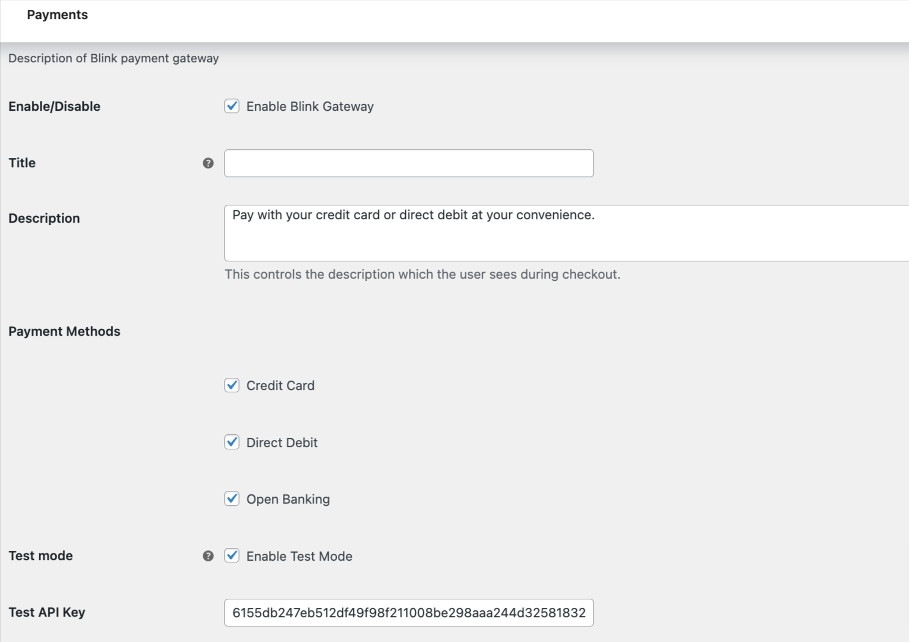

# wp-woocommerce-plugin

## Clone
1. Add your public SSH key to [github](https://github.com/)

2. Clone the repo:
```
git clone git@github.com:blink3sixty/plugin-woocommerce.git
```

## Install
Process 1. Directly clone the repo into the wp-content/plugins directly and unzip the source code. The plugin will be listed there. Activate it.
```

Process 2. Log into administrator account in your wordpress installation. Find Plugins->Add New Menu in the left side bar.
once click on it, user get a option to upload the plugin zip. Upload the plugin Zip downloaded from the Git repository.
The plugin will be listed there and activate it.
```


## Settings
Once you activate it, you get a settings link under the plugin name. Click on it and you wll redirected to Plugin payment Settings page.

1. First user have to activate the plugin. click on the Enable Blink Gateway checkbox.
2. Title and Description: User can set payment gateway title and description 
3. Payment methods: Select which payment methods you want to add to your blink payment gateway
4. Enable Test Mode: Depend on the selection payment host will change form dev or live environment.
5. API Key and Secret Key: Those keys should be obtain from Merchant account and use here. Those fields are self explanotory.
6. Custom Style: Use can put custom style into this text area. It can be used to overwrite the existing style of the payment form.
Note: Please don't use any style tag in to that text area.




```
```

# Custom CSS and Js

1. Two hooks are provided, if a developer wants to hook into the plugin and wants to inject some js and css. 

   'wc_blink_custom_script' and 'wc_blink_custom_style'


```
add_action('wc_blink_custom_script', function(){
   wp_enqueue_script('custom script handler');
});

add_action('wc_blink_custom_style', function(){
   wp_enqueue_style('custom style handler');
});
```
## References
```
https://developer.wordpress.org/reference/functions/wp_enqueue_script/

https://developer.wordpress.org/reference/functions/wp_enqueue_style/
```


## Required styling can be found from plugin root directory
  1. assets/css/style.css

## Required js can be found in plugin root directory

Following js files need to be added in payment form page

  1. https://gateway2.blinkpayment.co.uk/sdk/web/v1/js/hostedfields.min.js
  2. assets/js/custom.js

  hostedfields.min.js is required to tokenize the card details and create a paymentToken value on blink server which will be auto added in the payment form through this js file.

  custom.js is required to initiate the hosted js and also add some required values regarding browser settings for 3DS authentication.


## Order status update example"

`````
Headers:

Content-Type string
Content type is JSON.

Attributes:

'transaction_id' string
Transaction id.

'status' string
The new status of the transaction.

'note' string
Notification note.

'merchant_data' json
JSON string of all the optional data sent by the merchant.


`````

````
POST http://my_domain/wc-api/wc_blink_gateway/  HTTP/1.1
Content-Type: application/json

{
    "transaction_id": "BL-****",
    "status": "Captured",
    "note": "Status changes to Captured",
    "merchant_data": {
        "order_info":
        {
            "order_id":195,
        }
    }
}


`````


